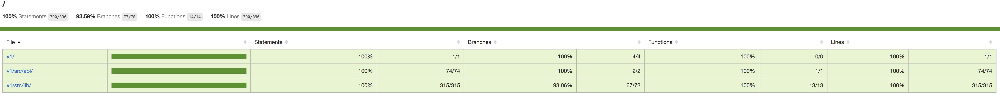

# Sample Recommendation API

to test
```
npm test
```

link to <a href='coverage/lcov-report/index.html'>Detail Test Coverage</a> <br/>


to run the app
```
npm start
```

parameters accepted on the /people-like-you
* age
* latitude
* longitude
* monthlyIncome
* experienced
* _recordSize :  to define how many record set will be return from endpoint, default to 10.